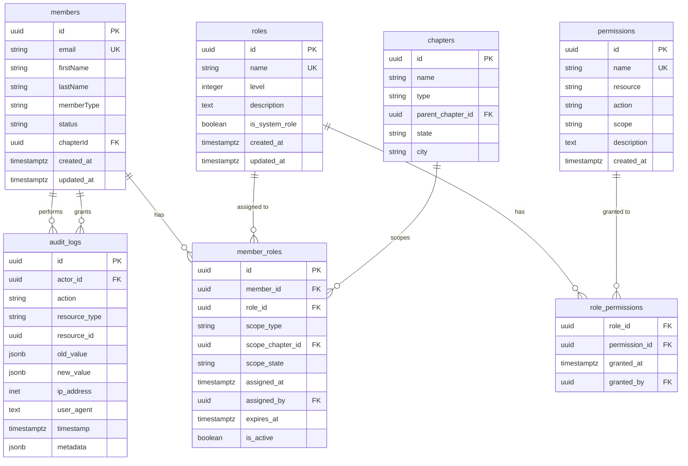

# RBAC Database Schema Design
## NABIP Association Management System

**Version:** 1.0
**Last Updated:** 2025-11-15
**Status:** Production Ready
**Target Database:** PostgreSQL 14+ (Supabase)

---

## Executive Summary

This document defines a comprehensive Role-Based Access Control (RBAC) system for the NABIP Association Management System, supporting 20,000+ members across a hierarchical chapter structure (National → State → Local). The design implements a 4-tier permission system with scope-based access control, comprehensive audit logging, and performance-optimized queries.

### Key Features
- **4-Tier Role Hierarchy:** Member, Chapter Admin, State Admin, National Admin
- **Scope-Based Permissions:** Own, Chapter, State, National
- **Permission Inheritance:** Higher roles inherit lower-level permissions
- **Temporal Role Assignments:** Support for expiring roles
- **Comprehensive Audit Trail:** 7-year retention for compliance
- **Row-Level Security (RLS):** Database-enforced access control
- **Multi-Tenancy Support:** Isolated data access per scope

---

## Entity-Relationship Diagram



---

## Database Schema

### 1. `roles` Table

**Purpose:** Define system and custom roles with hierarchical levels.

```sql
CREATE TABLE roles (
    -- Primary Key
    id UUID PRIMARY KEY DEFAULT gen_random_uuid(),

    -- Core Attributes
    name VARCHAR(100) NOT NULL UNIQUE,
    level INTEGER NOT NULL CHECK (level >= 1 AND level <= 10),
    description TEXT,
    is_system_role BOOLEAN NOT NULL DEFAULT false,

    -- Metadata
    created_at TIMESTAMPTZ NOT NULL DEFAULT NOW(),
    updated_at TIMESTAMPTZ NOT NULL DEFAULT NOW(),

    -- Constraints
    CONSTRAINT roles_name_lowercase CHECK (name = LOWER(name)),
    CONSTRAINT roles_level_positive CHECK (level > 0)
);

-- Indexes
CREATE INDEX idx_roles_level ON roles(level);
CREATE INDEX idx_roles_system ON roles(is_system_role) WHERE is_system_role = true;

-- Comments
COMMENT ON TABLE roles IS 'Defines system and custom roles with hierarchical levels';
COMMENT ON COLUMN roles.level IS 'Hierarchy: 1=member, 2=chapter_admin, 3=state_admin, 4=national_admin';
COMMENT ON COLUMN roles.is_system_role IS 'System roles cannot be deleted or modified';

-- Trigger for updated_at
CREATE TRIGGER roles_updated_at
    BEFORE UPDATE ON roles
    FOR EACH ROW
    EXECUTE FUNCTION update_updated_at_column();
```

**Business Rationale:**
- `level` enables permission inheritance (higher levels inherit lower-level permissions)
- `is_system_role` protects core roles from accidental deletion
- Role names use lowercase for consistent permission string matching

**Seed Data:**
```sql
INSERT INTO roles (name, level, description, is_system_role) VALUES
    ('member', 1, 'Standard member with access to own profile and public resources', true),
    ('chapter_admin', 2, 'Chapter administrator with management rights for a specific chapter', true),
    ('state_admin', 3, 'State administrator with oversight of all chapters in a state', true),
    ('national_admin', 4, 'National administrator with full system access', true);
```

---

### 2. `permissions` Table

**Purpose:** Granular permission definitions following resource.action.scope naming convention.

```sql
CREATE TABLE permissions (
    -- Primary Key
    id UUID PRIMARY KEY DEFAULT gen_random_uuid(),

    -- Core Attributes
    name VARCHAR(200) NOT NULL UNIQUE,
    resource VARCHAR(50) NOT NULL,
    action VARCHAR(50) NOT NULL,
    scope VARCHAR(50) NOT NULL,
    description TEXT,

    -- Metadata
    created_at TIMESTAMPTZ NOT NULL DEFAULT NOW(),

    -- Constraints
    CONSTRAINT permissions_name_format CHECK (
        name = LOWER(resource || '.' || action || '.' || scope)
    ),
    CONSTRAINT permissions_valid_resource CHECK (
        resource IN ('member', 'chapter', 'event', 'campaign', 'course',
                     'report', 'transaction', 'role', 'permission', 'audit', 'system')
    ),
    CONSTRAINT permissions_valid_action CHECK (
        action IN ('view', 'create', 'edit', 'delete', 'export', 'manage', 'assign')
    ),
    CONSTRAINT permissions_valid_scope CHECK (
        scope IN ('own', 'chapter', 'state', 'national', 'all', 'public')
    )
);

-- Indexes
CREATE INDEX idx_permissions_resource ON permissions(resource);
CREATE INDEX idx_permissions_resource_action ON permissions(resource, action);
CREATE INDEX idx_permissions_scope ON permissions(scope);

-- Comments
COMMENT ON TABLE permissions IS 'Granular permission definitions using resource.action.scope pattern';
COMMENT ON COLUMN permissions.name IS 'Unique permission identifier (e.g., member.view.chapter)';
COMMENT ON COLUMN permissions.scope IS 'Access scope: own, chapter, state, national, all, public';
```

**Business Rationale:**
- Naming convention `resource.action.scope` enables programmatic permission checking
- Enumerated constraints prevent invalid permission definitions
- Resource/action indexing optimizes dynamic permission lookups

**Example Permissions:**
```sql
-- Member Permissions
INSERT INTO permissions (name, resource, action, scope, description) VALUES
    ('member.view.own', 'member', 'view', 'own', 'View own member profile'),
    ('member.edit.own', 'member', 'edit', 'own', 'Edit own member profile'),
    ('member.view.chapter', 'member', 'view', 'chapter', 'View members in same chapter'),
    ('member.edit.chapter', 'member', 'edit', 'chapter', 'Edit members in same chapter'),
    ('member.view.state', 'member', 'view', 'state', 'View members across state'),
    ('member.view.national', 'member', 'view', 'national', 'View all members'),
    ('member.export.state', 'member', 'export', 'state', 'Export state member data');

-- Event Permissions
INSERT INTO permissions (name, resource, action, scope, description) VALUES
    ('event.view.public', 'event', 'view', 'public', 'View public events'),
    ('event.create.chapter', 'event', 'create', 'chapter', 'Create chapter events'),
    ('event.edit.chapter', 'event', 'edit', 'chapter', 'Edit chapter events'),
    ('event.delete.chapter', 'event', 'delete', 'chapter', 'Delete chapter events'),
    ('event.view.state', 'event', 'view', 'state', 'View all state events');

-- Campaign Permissions
INSERT INTO permissions (name, resource, action, scope, description) VALUES
    ('campaign.create.chapter', 'campaign', 'create', 'chapter', 'Create chapter email campaigns'),
    ('campaign.edit.chapter', 'campaign', 'edit', 'chapter', 'Edit chapter campaigns'),
    ('campaign.create.state', 'campaign', 'create', 'state', 'Create state-wide campaigns'),
    ('campaign.create.national', 'campaign', 'create', 'national', 'Create national campaigns');

-- Report Permissions
INSERT INTO permissions (name, resource, action, scope, description) VALUES
    ('report.view.own', 'report', 'view', 'own', 'View own reports'),
    ('report.view.chapter', 'report', 'view', 'chapter', 'View chapter reports'),
    ('report.view.state', 'report', 'view', 'state', 'View state analytics'),
    ('report.export.state', 'report', 'export', 'state', 'Export state reports');

-- Role Management Permissions
INSERT INTO permissions (name, resource, action, scope, description) VALUES
    ('role.assign.chapter', 'role', 'assign', 'chapter', 'Assign chapter admin roles'),
    ('role.assign.state', 'role', 'assign', 'state', 'Assign state admin roles'),
    ('role.assign.national', 'role', 'assign', 'national', 'Assign any role'),
    ('role.create.national', 'role', 'create', 'national', 'Create custom roles');

-- Audit Permissions
INSERT INTO permissions (name, resource, action, scope, description) VALUES
    ('audit.view.chapter', 'audit', 'view', 'chapter', 'View chapter audit logs'),
    ('audit.view.state', 'audit', 'view', 'state', 'View state audit logs'),
    ('audit.view.all', 'audit', 'view', 'all', 'View all audit logs');
```

---

### 3. `role_permissions` Table

**Purpose:** Many-to-many mapping between roles and permissions.

```sql
CREATE TABLE role_permissions (
    -- Composite Primary Key
    role_id UUID NOT NULL REFERENCES roles(id) ON DELETE CASCADE,
    permission_id UUID NOT NULL REFERENCES permissions(id) ON DELETE CASCADE,

    -- Metadata
    granted_at TIMESTAMPTZ NOT NULL DEFAULT NOW(),
    granted_by UUID REFERENCES members(id) ON DELETE SET NULL,

    -- Constraints
    PRIMARY KEY (role_id, permission_id)
);

-- Indexes
CREATE INDEX idx_role_permissions_role ON role_permissions(role_id);
CREATE INDEX idx_role_permissions_permission ON role_permissions(permission_id);
CREATE INDEX idx_role_permissions_granted_by ON role_permissions(granted_by);

-- Comments
COMMENT ON TABLE role_permissions IS 'Maps permissions to roles with audit trail';
COMMENT ON COLUMN role_permissions.granted_by IS 'Member who granted this permission to role';
```

**Business Rationale:**
- Composite primary key prevents duplicate permission assignments
- CASCADE delete ensures orphaned mappings don't persist
- `granted_by` tracks permission changes for compliance

**Seed Data (Permission Assignments):**
```sql
-- Member Role Permissions (Level 1)
INSERT INTO role_permissions (role_id, permission_id)
SELECT r.id, p.id
FROM roles r
CROSS JOIN permissions p
WHERE r.name = 'member'
  AND p.name IN (
    'member.view.own',
    'member.edit.own',
    'event.view.public',
    'report.view.own'
  );

-- Chapter Admin Role Permissions (Level 2 - Inherits Member + Additional)
INSERT INTO role_permissions (role_id, permission_id)
SELECT r.id, p.id
FROM roles r
CROSS JOIN permissions p
WHERE r.name = 'chapter_admin'
  AND p.name IN (
    -- Inherited Member permissions
    'member.view.own',
    'member.edit.own',
    'event.view.public',
    'report.view.own',
    -- Chapter-specific permissions
    'member.view.chapter',
    'member.edit.chapter',
    'event.create.chapter',
    'event.edit.chapter',
    'event.delete.chapter',
    'campaign.create.chapter',
    'campaign.edit.chapter',
    'report.view.chapter',
    'audit.view.chapter'
  );

-- State Admin Role Permissions (Level 3)
INSERT INTO role_permissions (role_id, permission_id)
SELECT r.id, p.id
FROM roles r
CROSS JOIN permissions p
WHERE r.name = 'state_admin'
  AND p.name IN (
    -- Inherited lower-level permissions
    'member.view.own', 'member.edit.own',
    'member.view.chapter', 'member.edit.chapter',
    'event.view.public', 'event.create.chapter', 'event.edit.chapter',
    -- State-specific permissions
    'member.view.state',
    'member.export.state',
    'event.view.state',
    'campaign.create.state',
    'report.view.state',
    'report.export.state',
    'audit.view.state',
    'role.assign.chapter'
  );

-- National Admin Role Permissions (Level 4)
INSERT INTO role_permissions (role_id, permission_id)
SELECT r.id, p.id
FROM roles r
CROSS JOIN permissions p
WHERE r.name = 'national_admin'
  AND (
    p.scope IN ('national', 'all') OR
    p.name LIKE 'role.%' OR
    p.name LIKE 'audit.%'
  );
```

---

### 4. `member_roles` Table

**Purpose:** Assign roles to members with scope and temporal controls.

```sql
CREATE TABLE member_roles (
    -- Primary Key
    id UUID PRIMARY KEY DEFAULT gen_random_uuid(),

    -- Foreign Keys
    member_id UUID NOT NULL REFERENCES members(id) ON DELETE CASCADE,
    role_id UUID NOT NULL REFERENCES roles(id) ON DELETE CASCADE,

    -- Scope Definition
    scope_type VARCHAR(20) NOT NULL CHECK (scope_type IN ('global', 'chapter', 'state')),
    scope_chapter_id UUID REFERENCES chapters(id) ON DELETE CASCADE,
    scope_state VARCHAR(2),

    -- Metadata
    assigned_at TIMESTAMPTZ NOT NULL DEFAULT NOW(),
    assigned_by UUID REFERENCES members(id) ON DELETE SET NULL,
    expires_at TIMESTAMPTZ,
    is_active BOOLEAN NOT NULL DEFAULT true,

    -- Constraints
    CONSTRAINT member_roles_unique_assignment UNIQUE (
        member_id, role_id, scope_type,
        COALESCE(scope_chapter_id::text, ''),
        COALESCE(scope_state, '')
    ),
    CONSTRAINT member_roles_chapter_scope CHECK (
        (scope_type = 'chapter' AND scope_chapter_id IS NOT NULL AND scope_state IS NULL) OR
        (scope_type = 'state' AND scope_state IS NOT NULL AND scope_chapter_id IS NULL) OR
        (scope_type = 'global' AND scope_chapter_id IS NULL AND scope_state IS NULL)
    ),
    CONSTRAINT member_roles_valid_state CHECK (
        scope_state IS NULL OR LENGTH(scope_state) = 2
    )
);

-- Indexes
CREATE INDEX idx_member_roles_member ON member_roles(member_id) WHERE is_active = true;
CREATE INDEX idx_member_roles_role ON member_roles(role_id);
CREATE INDEX idx_member_roles_chapter ON member_roles(scope_chapter_id) WHERE scope_chapter_id IS NOT NULL;
CREATE INDEX idx_member_roles_state ON member_roles(scope_state) WHERE scope_state IS NOT NULL;
CREATE INDEX idx_member_roles_assigned_by ON member_roles(assigned_by);
CREATE INDEX idx_member_roles_expires ON member_roles(expires_at) WHERE expires_at IS NOT NULL;
CREATE INDEX idx_member_roles_active_lookup ON member_roles(member_id, is_active, expires_at);

-- Comments
COMMENT ON TABLE member_roles IS 'Assigns roles to members with scope and temporal controls';
COMMENT ON COLUMN member_roles.scope_type IS 'Scope: global (all), chapter (specific chapter), state (all chapters in state)';
COMMENT ON COLUMN member_roles.scope_chapter_id IS 'Required for chapter scope, null otherwise';
COMMENT ON COLUMN member_roles.scope_state IS 'Two-letter state code for state scope (e.g., CA, TX)';
COMMENT ON COLUMN member_roles.expires_at IS 'Optional expiration for temporary role assignments';
```

**Business Rationale:**
- `scope_type` enables hierarchical access control (global > state > chapter > own)
- Unique constraint prevents duplicate role assignments with same scope
- CHECK constraints enforce scope integrity (chapter scope must have chapter_id)
- Filtered indexes optimize active role lookups
- Temporal support via `expires_at` enables term-limited administrative roles

**Example Assignments:**
```sql
-- All members get default 'member' role with global scope
INSERT INTO member_roles (member_id, role_id, scope_type)
SELECT m.id, r.id, 'global'
FROM members m
CROSS JOIN roles r
WHERE r.name = 'member';

-- Chapter president gets chapter_admin role for their chapter
INSERT INTO member_roles (member_id, role_id, scope_type, scope_chapter_id, assigned_by)
VALUES (
    '123e4567-e89b-12d3-a456-426614174000',
    (SELECT id FROM roles WHERE name = 'chapter_admin'),
    'chapter',
    'chapter-uuid-here',
    'admin-user-uuid'
);

-- State coordinator gets state_admin role for California
INSERT INTO member_roles (member_id, role_id, scope_type, scope_state, assigned_by)
VALUES (
    '223e4567-e89b-12d3-a456-426614174000',
    (SELECT id FROM roles WHERE name = 'state_admin'),
    'state',
    'CA',
    'national-admin-uuid'
);

-- Temporary chapter admin (expires after 1 year)
INSERT INTO member_roles (
    member_id, role_id, scope_type, scope_chapter_id,
    expires_at, assigned_by
)
VALUES (
    '323e4567-e89b-12d3-a456-426614174000',
    (SELECT id FROM roles WHERE name = 'chapter_admin'),
    'chapter',
    'chapter-uuid-here',
    NOW() + INTERVAL '1 year',
    'state-admin-uuid'
);
```

---

### 5. `audit_logs` Table

**Purpose:** Comprehensive audit trail for compliance (7-year retention).

```sql
CREATE TABLE audit_logs (
    -- Primary Key
    id UUID PRIMARY KEY DEFAULT gen_random_uuid(),

    -- Actor Information
    actor_id UUID REFERENCES members(id) ON DELETE SET NULL,

    -- Action Details
    action VARCHAR(100) NOT NULL,
    resource_type VARCHAR(50) NOT NULL,
    resource_id UUID,

    -- Change Tracking
    old_value JSONB,
    new_value JSONB,

    -- Context
    ip_address INET,
    user_agent TEXT,
    timestamp TIMESTAMPTZ NOT NULL DEFAULT NOW(),
    metadata JSONB,

    -- Constraints
    CONSTRAINT audit_logs_valid_action CHECK (
        action ~ '^[a-z_]+\.[a-z_]+$'
    )
);

-- Indexes (Partitioned by timestamp for performance)
CREATE INDEX idx_audit_logs_actor ON audit_logs(actor_id, timestamp DESC);
CREATE INDEX idx_audit_logs_resource ON audit_logs(resource_type, resource_id, timestamp DESC);
CREATE INDEX idx_audit_logs_action ON audit_logs(action, timestamp DESC);
CREATE INDEX idx_audit_logs_timestamp ON audit_logs(timestamp DESC);
CREATE INDEX idx_audit_logs_metadata ON audit_logs USING gin(metadata);

-- Comments
COMMENT ON TABLE audit_logs IS 'Comprehensive audit trail with 7-year retention for compliance';
COMMENT ON COLUMN audit_logs.action IS 'Action in format: resource.operation (e.g., role.assign, member.edit)';
COMMENT ON COLUMN audit_logs.old_value IS 'Previous state before change (for update/delete actions)';
COMMENT ON COLUMN audit_logs.new_value IS 'New state after change (for create/update actions)';
COMMENT ON COLUMN audit_logs.metadata IS 'Additional context (source, reason, approval_id, etc.)';

-- Partitioning for performance (quarterly partitions)
CREATE TABLE audit_logs_2025_q1 PARTITION OF audit_logs
    FOR VALUES FROM ('2025-01-01') TO ('2025-04-01');

CREATE TABLE audit_logs_2025_q2 PARTITION OF audit_logs
    FOR VALUES FROM ('2025-04-01') TO ('2025-07-01');

-- Function to auto-create partitions
CREATE OR REPLACE FUNCTION create_audit_partition()
RETURNS void AS $$
DECLARE
    partition_name TEXT;
    start_date DATE;
    end_date DATE;
BEGIN
    start_date := DATE_TRUNC('quarter', NOW());
    end_date := start_date + INTERVAL '3 months';
    partition_name := 'audit_logs_' || TO_CHAR(start_date, 'YYYY_Q');

    EXECUTE format(
        'CREATE TABLE IF NOT EXISTS %I PARTITION OF audit_logs FOR VALUES FROM (%L) TO (%L)',
        partition_name, start_date, end_date
    );
END;
$$ LANGUAGE plpgsql;
```

**Business Rationale:**
- JSONB columns enable flexible change tracking without schema modifications
- Partitioning by timestamp optimizes queries and enables efficient data archival
- GIN index on metadata enables complex filter queries
- 7-year retention meets typical compliance requirements (GDPR, SOX)

**Example Audit Entries:**
```sql
-- Log role assignment
INSERT INTO audit_logs (actor_id, action, resource_type, resource_id, new_value, ip_address, metadata)
VALUES (
    'national-admin-uuid',
    'role.assign',
    'member_role',
    'member-role-uuid',
    '{"role": "chapter_admin", "scope": "chapter", "chapter_id": "chapter-uuid"}'::jsonb,
    '192.168.1.1',
    '{"reason": "Annual chapter election", "approval_id": "approval-123"}'::jsonb
);

-- Log permission denial (security monitoring)
INSERT INTO audit_logs (actor_id, action, resource_type, resource_id, metadata)
VALUES (
    'member-uuid',
    'permission.denied',
    'member',
    'target-member-uuid',
    '{"attempted_action": "member.edit.chapter", "reason": "insufficient_permissions"}'::jsonb
);
```

---

## Helper Functions

### 1. Auto-Update Timestamp Function

```sql
CREATE OR REPLACE FUNCTION update_updated_at_column()
RETURNS TRIGGER AS $$
BEGIN
    NEW.updated_at = NOW();
    RETURN NEW;
END;
$$ LANGUAGE plpgsql;
```

### 2. Check Permission Function

```sql
CREATE OR REPLACE FUNCTION has_permission(
    p_member_id UUID,
    p_resource VARCHAR,
    p_action VARCHAR,
    p_target_chapter_id UUID DEFAULT NULL,
    p_target_state VARCHAR DEFAULT NULL
)
RETURNS BOOLEAN AS $$
DECLARE
    v_has_permission BOOLEAN;
BEGIN
    -- Check if member has required permission through any active role
    SELECT EXISTS (
        SELECT 1
        FROM member_roles mr
        INNER JOIN role_permissions rp ON mr.role_id = rp.role_id
        INNER JOIN permissions p ON rp.permission_id = p.id
        WHERE mr.member_id = p_member_id
          AND mr.is_active = true
          AND (mr.expires_at IS NULL OR mr.expires_at > NOW())
          AND p.resource = p_resource
          AND p.action = p_action
          AND (
              -- Global scope matches everything
              (mr.scope_type = 'global') OR
              -- State scope matches state or specific chapters in state
              (mr.scope_type = 'state' AND mr.scope_state = p_target_state) OR
              -- Chapter scope matches specific chapter
              (mr.scope_type = 'chapter' AND mr.scope_chapter_id = p_target_chapter_id) OR
              -- Own scope (handled at application level)
              (p.scope = 'own') OR
              -- Public scope is accessible to all
              (p.scope = 'public')
          )
    ) INTO v_has_permission;

    RETURN v_has_permission;
END;
$$ LANGUAGE plpgsql STABLE;

-- Example usage:
-- SELECT has_permission('member-uuid', 'member', 'view', 'chapter-uuid', NULL);
```

### 3. Get Member Permissions Function

```sql
CREATE OR REPLACE FUNCTION get_member_permissions(p_member_id UUID)
RETURNS TABLE (
    permission_name VARCHAR,
    scope_type VARCHAR,
    scope_chapter_id UUID,
    scope_state VARCHAR
) AS $$
BEGIN
    RETURN QUERY
    SELECT DISTINCT
        p.name,
        mr.scope_type,
        mr.scope_chapter_id,
        mr.scope_state
    FROM member_roles mr
    INNER JOIN role_permissions rp ON mr.role_id = rp.role_id
    INNER JOIN permissions p ON rp.permission_id = p.id
    WHERE mr.member_id = p_member_id
      AND mr.is_active = true
      AND (mr.expires_at IS NULL OR mr.expires_at > NOW())
    ORDER BY p.name;
END;
$$ LANGUAGE plpgsql STABLE;
```

### 4. Expire Role Assignments Function

```sql
CREATE OR REPLACE FUNCTION expire_member_roles()
RETURNS INTEGER AS $$
DECLARE
    v_expired_count INTEGER;
BEGIN
    UPDATE member_roles
    SET is_active = false
    WHERE is_active = true
      AND expires_at IS NOT NULL
      AND expires_at <= NOW();

    GET DIAGNOSTICS v_expired_count = ROW_COUNT;

    -- Log expiration events
    INSERT INTO audit_logs (action, resource_type, metadata)
    VALUES (
        'role.auto_expired',
        'member_role',
        jsonb_build_object('expired_count', v_expired_count)
    );

    RETURN v_expired_count;
END;
$$ LANGUAGE plpgsql;

-- Schedule via cron or pg_cron
-- SELECT cron.schedule('expire-roles', '0 0 * * *', 'SELECT expire_member_roles()');
```

---

## Performance Considerations

### Index Strategy

**Query Pattern: "What permissions does this member have?"**
```sql
-- Optimized by: idx_member_roles_active_lookup, idx_role_permissions_role
EXPLAIN ANALYZE
SELECT p.name, p.resource, p.action, p.scope
FROM member_roles mr
INNER JOIN role_permissions rp ON mr.role_id = rp.role_id
INNER JOIN permissions p ON rp.permission_id = p.id
WHERE mr.member_id = '123e4567-e89b-12d3-a456-426614174000'
  AND mr.is_active = true
  AND (mr.expires_at IS NULL OR mr.expires_at > NOW());
```

**Query Pattern: "Who has admin access to this chapter?"**
```sql
-- Optimized by: idx_member_roles_chapter, idx_member_roles_role
EXPLAIN ANALYZE
SELECT m.id, m.email, m.firstName, m.lastName, r.name as role
FROM member_roles mr
INNER JOIN members m ON mr.member_id = m.id
INNER JOIN roles r ON mr.role_id = r.id
WHERE mr.scope_chapter_id = 'chapter-uuid'
  AND mr.is_active = true
  AND r.level >= 2;
```

**Query Pattern: "Audit trail for a specific member"**
```sql
-- Optimized by: idx_audit_logs_resource (partitioned)
EXPLAIN ANALYZE
SELECT action, timestamp, old_value, new_value, metadata
FROM audit_logs
WHERE resource_type = 'member'
  AND resource_id = 'member-uuid'
  AND timestamp >= NOW() - INTERVAL '90 days'
ORDER BY timestamp DESC
LIMIT 100;
```

### Performance Targets

| Operation | Target Latency | Index Strategy |
|-----------|---------------|----------------|
| Permission check (cached) | < 10ms | In-memory cache |
| Permission check (DB query) | < 50ms | Composite indexes |
| Role lookup | < 50ms | Filtered indexes |
| Permission matrix load | < 200ms | Eager loading with JOIN |
| Audit log query (30 days) | < 500ms | Partitioned indexes |
| Role assignment | < 100ms | Transactional insert |

### Caching Strategy

**Client-Side:**
- Cache member roles in React Context on login
- Refresh every 5 minutes or on role change event
- Invalidate on logout

**Server-Side (Supabase):**
- Enable Supabase Realtime for `member_roles` table
- Push role changes to connected clients via WebSocket
- Cache permission lookups in Redis for 5 minutes

---

## Security Considerations

### SQL Injection Prevention
All queries use parameterized statements via Supabase client libraries.

### Privilege Escalation Protection
```sql
-- Prevent members from assigning roles above their own level
CREATE OR REPLACE FUNCTION check_role_assignment_authority()
RETURNS TRIGGER AS $$
DECLARE
    v_assigner_max_level INTEGER;
    v_role_level INTEGER;
BEGIN
    -- Get highest role level of assigner
    SELECT MAX(r.level)
    INTO v_assigner_max_level
    FROM member_roles mr
    INNER JOIN roles r ON mr.role_id = r.id
    WHERE mr.member_id = NEW.assigned_by
      AND mr.is_active = true;

    -- Get level of role being assigned
    SELECT level INTO v_role_level
    FROM roles
    WHERE id = NEW.role_id;

    -- Prevent assignment if assigner's level is insufficient
    IF v_assigner_max_level < v_role_level THEN
        RAISE EXCEPTION 'Insufficient authority to assign role (level % required)', v_role_level;
    END IF;

    RETURN NEW;
END;
$$ LANGUAGE plpgsql;

CREATE TRIGGER validate_role_assignment
    BEFORE INSERT ON member_roles
    FOR EACH ROW
    WHEN (NEW.assigned_by IS NOT NULL)
    EXECUTE FUNCTION check_role_assignment_authority();
```

### Session Security
- Token expiration: 1 hour (access token), 7 days (refresh token)
- Refresh token rotation on use
- IP address tracking in audit logs
- Suspicious activity alerts (e.g., rapid permission checks from different IPs)

---

## Migration Strategy

See `RBAC_MIGRATION_GUIDE.md` for detailed migration instructions.

**Summary:**
1. Create RBAC tables in separate schema
2. Seed system roles and permissions
3. Migrate existing member data (assign default "member" role)
4. Manual assignment of admin roles
5. Enable RLS policies
6. Deploy application code with permission checks
7. Validate and monitor for 30 days
8. Archive old audit logs after 7 years

---

## Compliance & Retention

**GDPR Compliance:**
- Right to access: Export member audit logs via admin interface
- Right to erasure: Soft delete members, anonymize audit logs after 7 years
- Data minimization: Only log essential audit information

**Retention Policy:**
- Active audit logs: 7 years
- Archived logs: Compressed and stored in cold storage
- Automated archival: Quarterly partition rotation

---

## Version History

| Version | Date | Author | Changes |
|---------|------|--------|---------|
| 1.0 | 2025-11-15 | System Architect | Initial comprehensive design |

---

## References

- Permission Matrix: `RBAC_PERMISSION_MATRIX.md`
- RLS Policies: `RBAC_RLS_POLICIES.md`
- Migration Guide: `RBAC_MIGRATION_GUIDE.md`
- Admin Guide: `RBAC_ADMIN_GUIDE.md`
- TypeScript Utilities: `src/lib/rbac/`
