# RBAC Entity-Relationship Diagram
## NABIP Association Management System

**Version:** 1.0
**Last Updated:** 2025-11-15

---

## Complete ER Diagram (Mermaid Format)

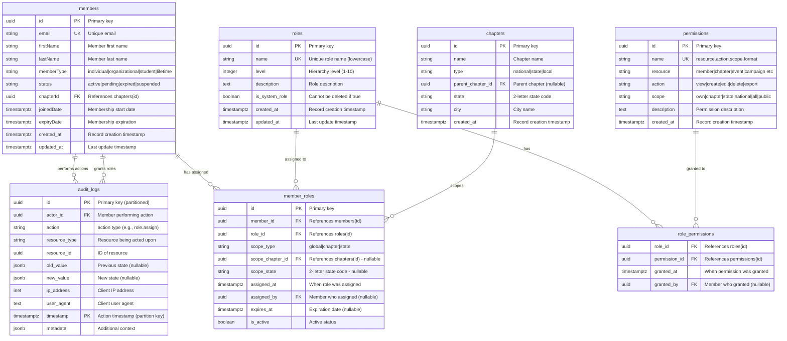

---

## Simplified Core RBAC Diagram

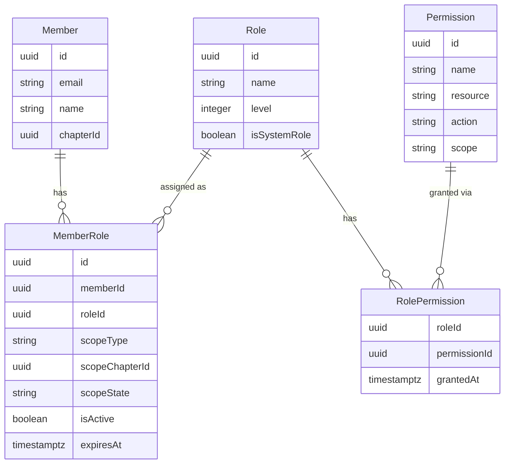

---

## Permission Inheritance Flow

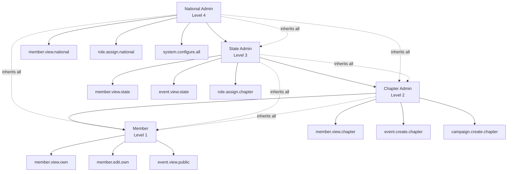

---

## Scope Hierarchy Visualization

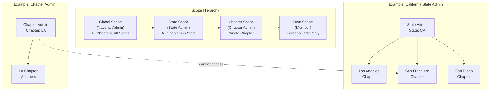

---

## Permission Check Flow

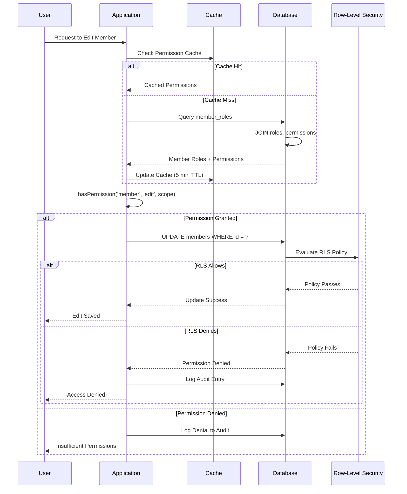

---

## Role Assignment Workflow

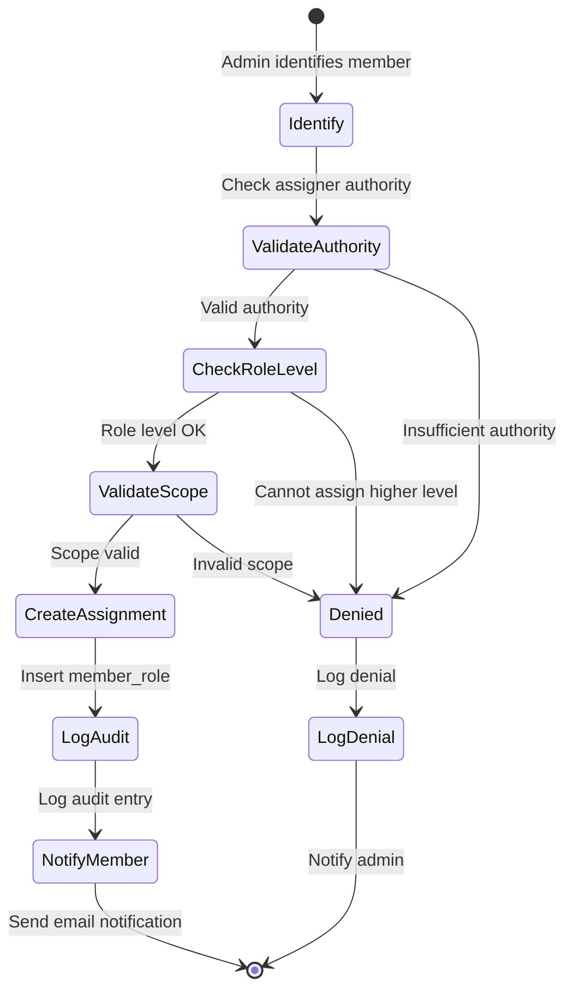

---

## Multi-Scope Role Example

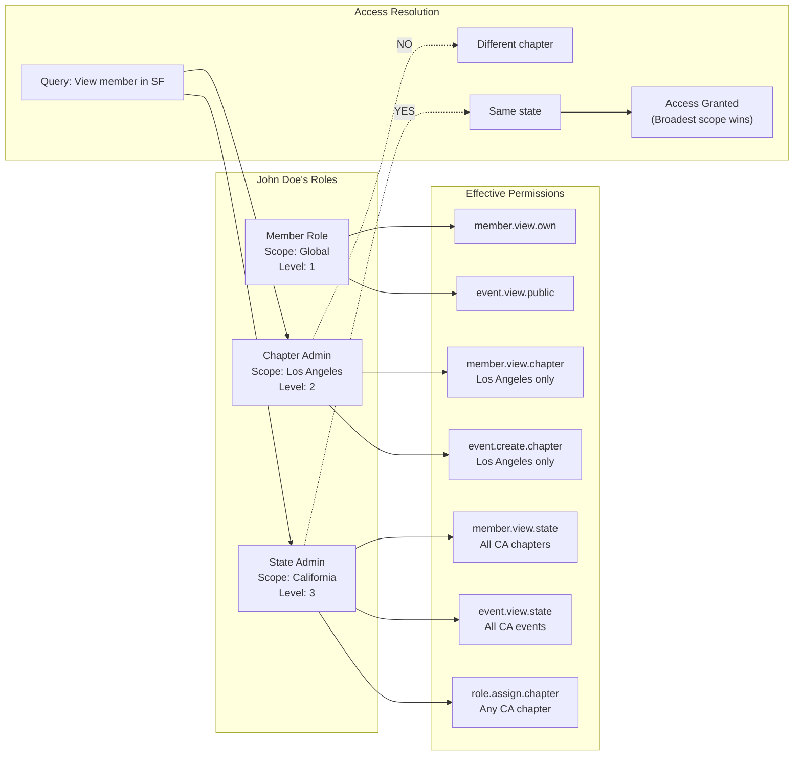

---

## Audit Log Partitioning Strategy

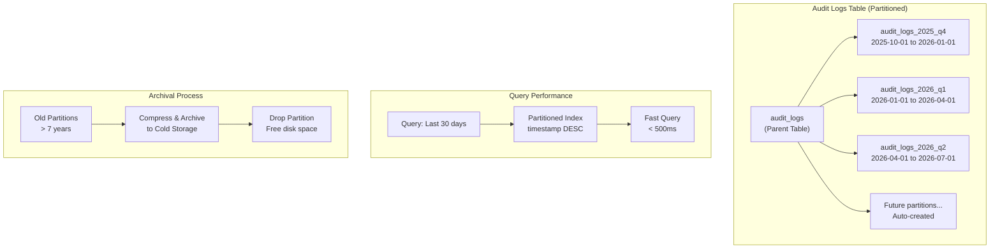

---

## Permission Naming Convention

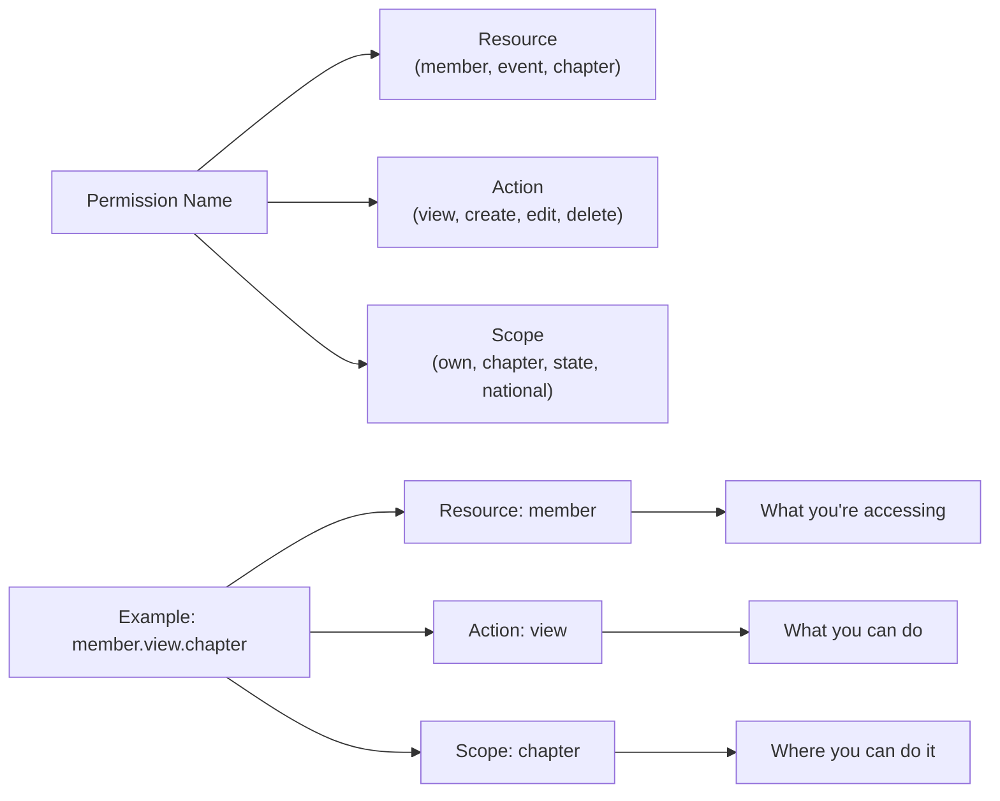

---

## Chapter Hierarchy with RBAC Scopes

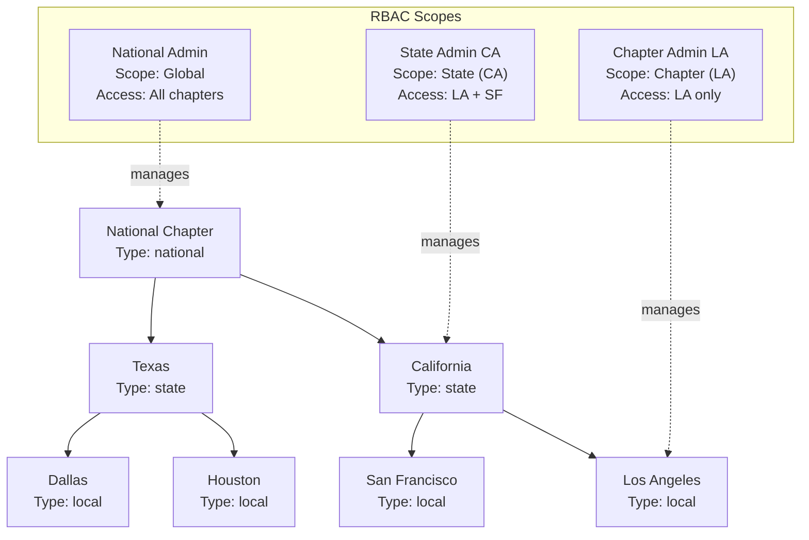

---

## Database Table Relationships Summary

| Table | Related To | Relationship Type | Purpose |
|-------|-----------|------------------|---------|
| **members** | member_roles | One-to-Many | Member has multiple role assignments |
| **members** | chapters | Many-to-One | Member belongs to one chapter |
| **members** | audit_logs | One-to-Many | Member performs actions |
| **roles** | member_roles | One-to-Many | Role assigned to multiple members |
| **roles** | role_permissions | One-to-Many | Role has multiple permissions |
| **permissions** | role_permissions | One-to-Many | Permission granted to multiple roles |
| **chapters** | member_roles | One-to-Many | Chapter scopes multiple role assignments |
| **chapters** | chapters | Self-Reference | Parent-child hierarchy |
| **member_roles** | members | Many-to-One | Role assignment belongs to member |
| **member_roles** | roles | Many-to-One | Assignment uses specific role |
| **member_roles** | chapters | Many-to-One | Assignment scoped to chapter |
| **role_permissions** | roles | Many-to-One | Permission mapping uses role |
| **role_permissions** | permissions | Many-to-One | Permission mapping uses permission |
| **audit_logs** | members | Many-to-One | Log entry created by member |

---

## Index Coverage Map

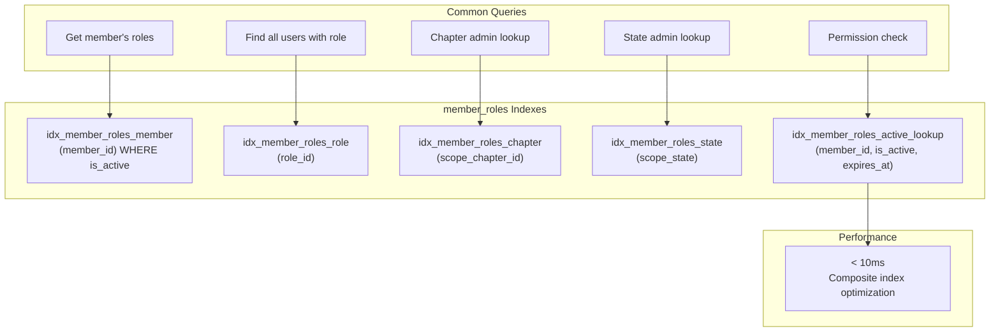

---

## Related Documentation

- **Database Schema:** `RBAC_DATABASE_SCHEMA.md`
- **Permission Matrix:** `RBAC_PERMISSION_MATRIX.md`
- **RLS Policies:** `RBAC_RLS_POLICIES.md`
- **Migration Guide:** `RBAC_MIGRATION_GUIDE.md`
- **Admin Guide:** `RBAC_ADMIN_GUIDE.md`
- **TypeScript Utilities:** `RBAC_TYPESCRIPT_UTILITIES.md`
- **Implementation Summary:** `RBAC_IMPLEMENTATION_SUMMARY.md`

---

## Notes

All diagrams are in Mermaid format and can be rendered in:
- GitHub (native support)
- Markdown viewers (with Mermaid plugin)
- Documentation sites (MkDocs, Docusaurus, etc.)
- Visual Studio Code (with Mermaid extension)

**Version:** 1.0
**Last Updated:** 2025-11-15
